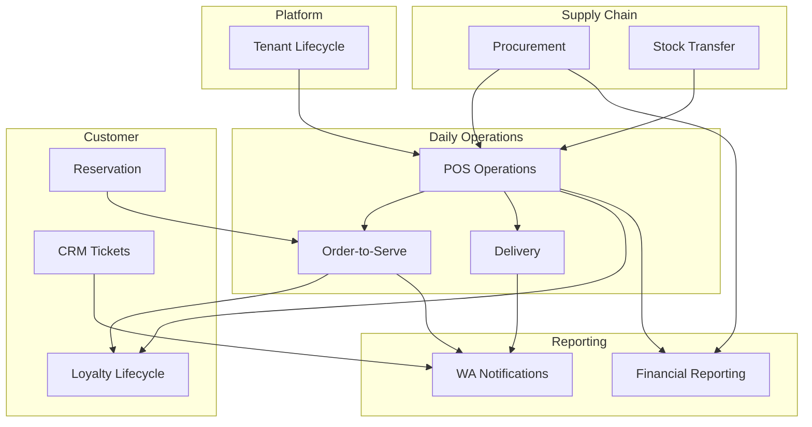

# TAHAP 1 — Business Process

## CreativePOS Business Process Documentation

---

## BP-01: Tenant Lifecycle Management

### Process Owner: Super Admin

```
[Start] → Register Tenant → Assign Package → Activate Subscription
    → Owner Onboarding → Setup Complete → [Active Tenant]
    
[Active] → Monitor Usage → Renewal Due? 
    → Yes → Send Invoice → Payment Received? 
        → Yes → Extend Subscription → [Active]
        → No → Grace Period → Payment Received?
            → Yes → [Active]
            → No → Suspend Tenant → [Suspended]
    → Upgrade Request? → Process Upgrade → [Active]
    → Churn/Cancel? → Deactivate → Archive Data → [Terminated]
```

### Business Rules

| Rule ID | Rule |
|---------|------|
| BP01-R01 | Tenant baru mendapat trial 14 hari (Starter features) |
| BP01-R02 | Grace period 7 hari setelah invoice due date |
| BP01-R03 | Data tenant di-archive 90 hari setelah terminate |
| BP01-R04 | Upgrade efektif immediately, downgrade efektif next billing cycle |
| BP01-R05 | Suspend = read-only access, no new transactions |

---

## BP-02: Daily POS Operations

### Process Owner: Cashier / Supervisor

```
[Start of Day]
    → Cashier Login → Open Shift (input opening cash)
    → Ready for Transactions

[Transaction Loop]
    → Customer Order → Add Products → Apply Discounts
    → Process Payment → Print Receipt → [Transaction Complete]
    → Stock Auto-Deducted → Points Auto-Earned (if member)
    → Repeat...

[End of Day]
    → Close Shift → Cash Reconciliation
    → Generate Shift Report → Supervisor Review
    → [End of Day]
```

### Business Rules

| Rule ID | Rule |
|---------|------|
| BP02-R01 | Shift harus dibuka sebelum transaksi pertama |
| BP02-R02 | Void memerlukan supervisor PIN/approval |
| BP02-R03 | Refund maksimal 30 hari setelah transaksi |
| BP02-R04 | Diskon maksimal 100% dari subtotal |
| BP02-R05 | Split payment minimal 2 metode |
| BP02-R06 | Cash drawer variance > Rp 50.000 butuh supervisor approval |

---

## BP-03: Inventory Procurement

### Process Owner: Manager

```
[Stock Alert] → Review Low Stock → Create Purchase Order
    → Submit for Approval → Manager/Owner Approve
    → Send PO to Supplier → [Waiting Delivery]
    → Goods Arrive → Create Goods Receipt (GRN)
    → Match PO vs Received → Discrepancy?
        → Yes → Partial Receipt / Create Dispute
        → No → Full Receipt
    → Stock Updated → [Complete]
```

### Business Rules

| Rule ID | Rule |
|---------|------|
| BP03-R01 | PO > Rp 5.000.000 butuh Owner approval |
| BP03-R02 | GRN harus reference ke PO yang valid |
| BP03-R03 | Partial receipt allowed, remaining PO stays open |
| BP03-R04 | Purchase return dalam 14 hari setelah GRN |
| BP03-R05 | Stock opname minimal 1x per bulan |

---

## BP-04: Order-to-Serve (Dine-In)

### Process Owner: Waiter / Kitchen / Cashier

```
[Customer Arrives]
    → Seated at Table → Order via:
        ├── Waiter takes order (POS)
        ├── Customer self-order (QR Menu)
        └── Reservation pre-order
    
    → Order Created → Kitchen Display (Pending)
    → Chef: Start Cooking (Cooking)
    → Chef: Food Ready (Ready)
    → Waiter: Serve to Table (Served)
    → Customer Finishes → Request Bill
    → Payment at POS → Receipt Printed
    → Table Available → [Complete]
```

### Business Rules

| Rule ID | Rule |
|---------|------|
| BP04-R01 | Order dari QR Menu otomatis link ke table number |
| BP04-R02 | Kitchen SLA: Pending → Cooking max 2 menit |
| BP04-R03 | Order timeout alert jika Ready > 10 menit belum Served |
| BP04-R04 | Split bill available sebelum payment |
| BP04-R05 | Service charge 5-10% configurable per outlet |

---

## BP-05: Delivery Operations

### Process Owner: Manager / Driver

```
[Order Received] → Validate Address → Calculate Shipping Fee
    → Customer Confirm & Pay → Order to Kitchen
    → Status: Cooking → Ready for Pickup
    → Assign Driver (auto/manual)
    → Driver Accept → Navigate to Outlet → Pickup Order
    → Status: Delivering → GPS Tracking Active
    → Arrive at Customer → Delivery Proof (photo)
    → Status: Completed → Customer Rating → [Complete]
```

### Business Rules

| Rule ID | Rule |
|---------|------|
| BP05-R01 | Delivery hanya dalam radius yang dikonfigurasi |
| BP05-R02 | Driver auto-assign berdasarkan proximity & availability |
| BP05-R03 | ETA = prep time + travel time (Google Maps) |
| BP05-R04 | Delivery fee: flat Rp 10.000 atau Rp 5.000/km |
| BP05-R05 | Driver timeout: tidak pickup dalam 15 menit → reassign |

---

## BP-06: Member Loyalty Lifecycle

### Process Owner: System (Automated) + Manager

```
[Registration] → Member Created (Bronze Tier)
    → Transaction at POS → Points Earned (per config)
    → Accumulate Points → Tier Threshold Reached?
        → Yes → Auto Upgrade Tier → Notification (WA/Email)
    → Birthday? → Auto Birthday Reward
    → Referral Used? → Reward Referrer + Referee
    → Points Redeem at POS/Portal → Points Deducted
    → Points Expiry (if configured) → Points Expired
    → [Ongoing]
```

### Tier Thresholds (Default)

| Tier | Minimum Spend (12 months) | Point Multiplier |
|------|--------------------------|------------------|
| Bronze | Rp 0 | 1x |
| Silver | Rp 5.000.000 | 1.5x |
| Gold | Rp 15.000.000 | 2x |
| Platinum | Rp 50.000.000 | 3x |

### Business Rules

| Rule ID | Rule |
|---------|------|
| BP06-R01 | Default: Rp 10.000 spend = 1 point |
| BP06-R02 | Point expiry: 12 bulan sejak earn (configurable) |
| BP06-R03 | Minimum redeem: 100 points |
| BP06-R04 | Birthday reward: auto-send 7 hari sebelum birthday |
| BP06-R05 | Referral reward: both parties get 50 points |

---

## BP-07: Reservation Management

### Process Owner: Manager / Waiter

```
[Reservation Request] → Check Availability → Available?
    → No → Suggest Alternative Time → Customer Accept?
        → No → [Cancelled]
        → Yes → Continue
    → Yes → Create Reservation (Pending)
    → Staff Confirm → Status: Confirmed
    → Send Reminder H-1 (WA/Email)
    → Send Reminder H-0 (2 jam sebelum)
    → Customer Arrives? 
        → Yes → Mark Arrived → Assign Table → Serve → Completed
        → No (15 min late) → Mark No-Show → Auto Cancel → [Cancelled]
```

### Business Rules

| Rule ID | Rule |
|---------|------|
| BP07-R01 | Reservasi maksimal 30 hari ke depan |
| BP07-R02 | Slot waktu: per 30 menit / 1 jam (configurable) |
| BP07-R03 | No-show threshold: 15 menit setelah waktu reservasi |
| BP07-R04 | Maksimal 20 tamu per reservasi (configurable) |
| BP07-R05 | Deposit required untuk grup > 10 orang (optional) |

---

## BP-08: CRM Ticket Resolution

### Process Owner: Customer Service Agent

```
[Ticket Created] → Auto-Assign Agent → SLA Timer Start
    → Agent Review → Need More Info?
        → Yes → Status: Pending → Request Info → Customer Reply → Resume
        → No → Troubleshoot → Resolved?
            → Yes → Status: Resolved → Customer Confirm?
                → Yes → Status: Closed → CSAT Survey
                → No → Reopen → Continue
            → No → Escalate → Senior Agent → Continue
    → SLA Breach? → Auto-Escalate → Notify Manager
```

### SLA Targets

| Priority | First Response | Resolution |
|----------|---------------|------------|
| Critical | 15 menit | 2 jam |
| High | 30 menit | 4 jam |
| Medium | 2 jam | 24 jam |
| Low | 4 jam | 48 jam |

---

## BP-09: Financial Reporting Cycle

### Process Owner: Owner / Manager

```
[Daily]   → Auto-generate Daily Sales Report → Email to Manager
[Weekly]  → Auto-generate Weekly Summary → Email to Owner
[Monthly] → Month-End Close:
    → Generate P&L Report
    → Generate Cash Flow Report
    → Generate Tax Report (PPN)
    → Inventory Valuation
    → Owner Review & Approve
[Yearly]  → Annual Report → Tax Filing Support
```

---

## BP-10: WhatsApp Notification Pipeline

### Process Owner: System (Automated)

```
[Trigger Event] → Select Template → Personalize Message
    → Check WA Quota (per package) → Quota Available?
        → No → Queue for Next Day / Fallback to Email
        → Yes → Send via WA API → Delivery Status?
            → Delivered → Log Success
            → Failed → Retry (max 3x) → Fallback to Email → Log Failure
```

### Trigger Events

| Event | Template | Channel |
|-------|----------|---------|
| OTP Login | `otp_verification` | WA |
| Transaction Complete | `invoice_receipt` | WA + Email |
| Reservation H-1 | `reservation_reminder` | WA |
| Point Earned | `loyalty_points` | WA |
| Tier Upgrade | `tier_upgrade` | WA |
| Promo Campaign | `promo_broadcast` | WA |
| Delivery Status | `delivery_update` | WA |

---

## BP-11: Multi-Outlet Stock Transfer

### Process Owner: Manager

```
[Transfer Request] → Select Source Outlet/Warehouse
    → Select Destination → Select Products & Quantities
    → Validate Source Stock → Sufficient?
        → No → Reject / Partial Transfer
        → Yes → Create Transfer Order (Pending)
    → Source: Stock Out → In Transit
    → Destination: Receive → Verify Quantities
    → Match? 
        → Yes → Stock In at Destination → [Complete]
        → No → Discrepancy Report → Investigation
```

---

## Process Interaction Map

