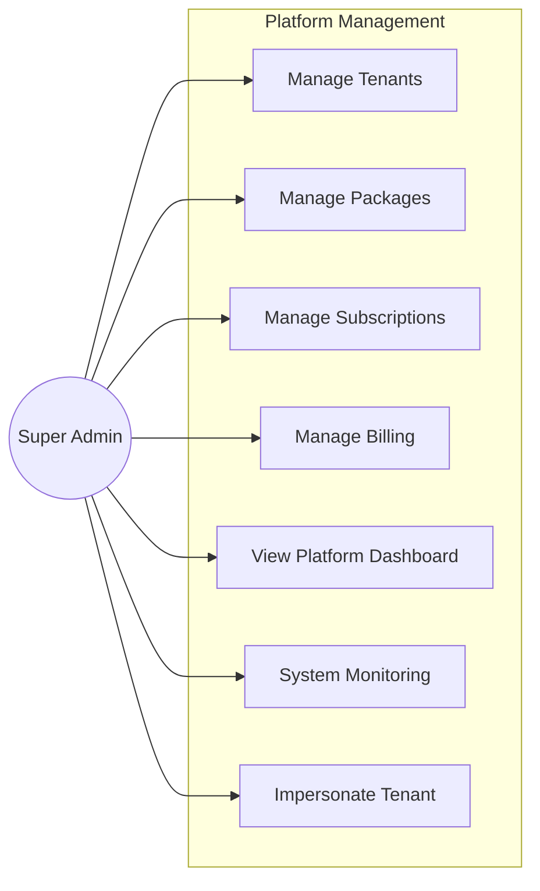
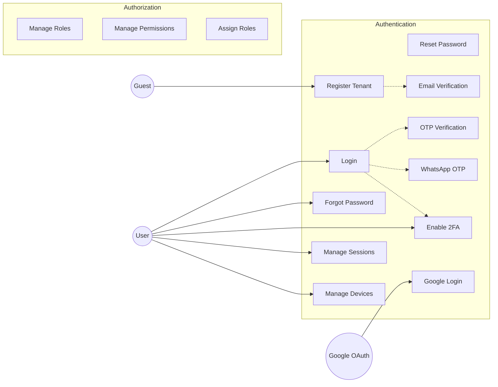
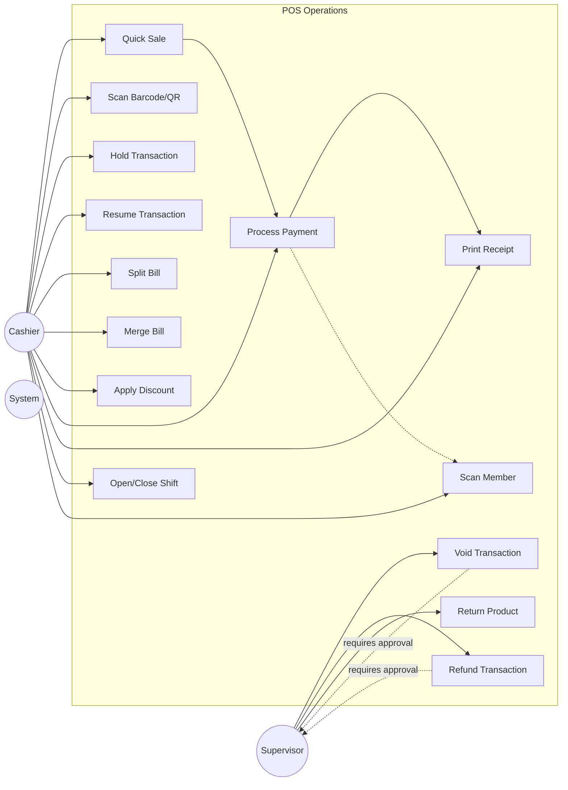
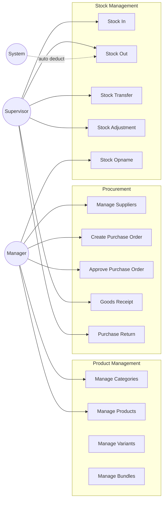
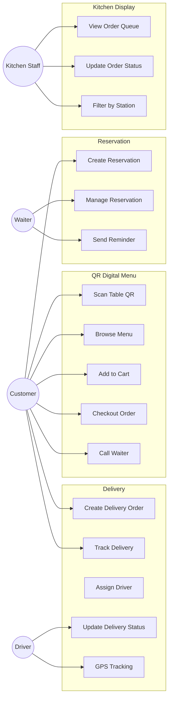
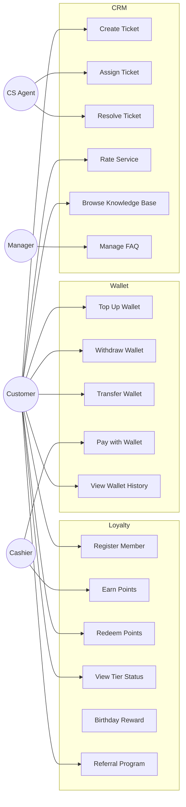
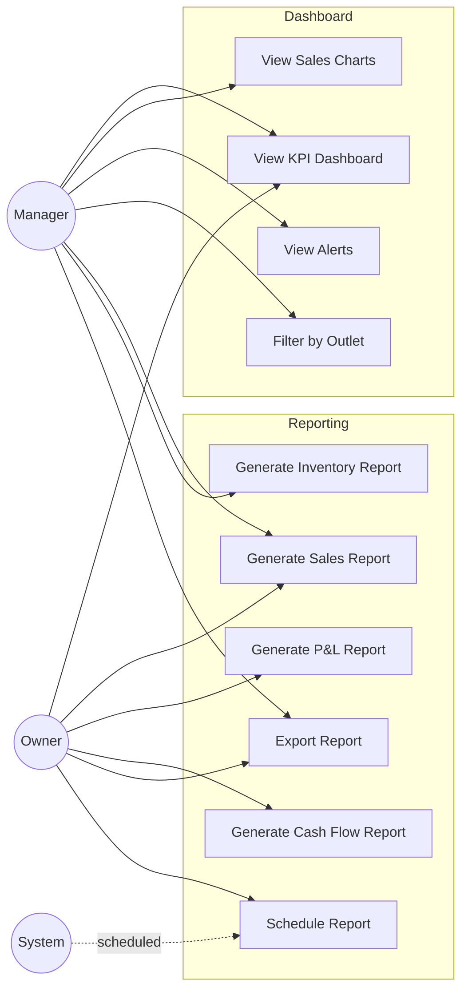
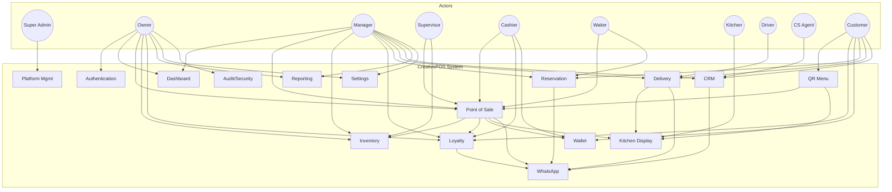

# TAHAP 1 — Use Case Diagram

## CreativePOS Use Case Model

---

## 1. Platform Level (Super Admin)

### Use Case Detail — Platform

| UC ID | Use Case | Actor | Description |
|-------|----------|-------|-------------|
| UC-P01 | Manage Tenants | Super Admin | CRUD tenant, suspend, activate, delete |
| UC-P02 | Manage Packages | Super Admin | CRUD subscription packages & features |
| UC-P03 | Manage Subscriptions | Super Admin | Create, renew, upgrade/downgrade |
| UC-P04 | Manage Billing | Super Admin | Invoice generation, payment tracking |
| UC-P05 | View Platform Dashboard | Super Admin | MRR, churn, tenant metrics |
| UC-P06 | System Monitoring | Super Admin | Health check, queue status |
| UC-P07 | Impersonate Tenant | Super Admin | Login as tenant for support |

---

## 2. Authentication Module

---

## 3. POS Module

---

## 4. Inventory Module

---

## 5. Customer-Facing Modules

---

## 6. Loyalty, Wallet & CRM

---

## 7. Reporting & Dashboard

---

## 8. Complete System Use Case Overview

---

## Use Case Summary

| Module | Total Use Cases | Primary Actors |
|--------|----------------|----------------|
| Platform | 7 | Super Admin |
| Authentication | 14 | All Users |
| Dashboard | 6 | Owner, Manager |
| POS | 14 | Cashier, Supervisor |
| Inventory | 14 | Manager, Supervisor |
| Loyalty | 6 | Customer, Cashier |
| Wallet | 5 | Customer, Cashier |
| QR Menu | 5 | Customer |
| Kitchen Display | 3 | Kitchen |
| Reservation | 3 | Customer, Waiter, Manager |
| Delivery | 5 | Customer, Driver, Manager |
| CRM | 6 | Customer, CS Agent |
| WhatsApp | 4 | System, Manager |
| Reporting | 6 | Owner, Manager |
| Settings | 5 | Owner, Manager |
| Audit | 4 | Owner |
| **Total** | **~107** | **10 actor types** |