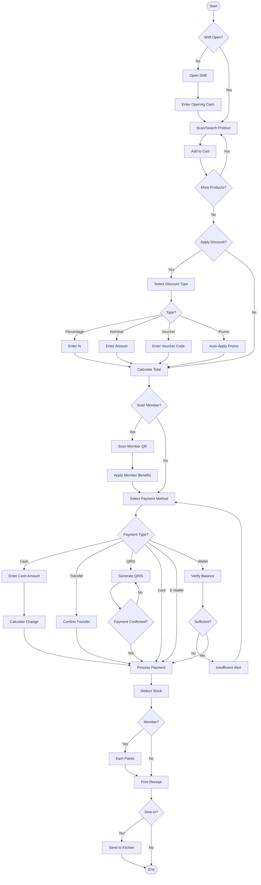
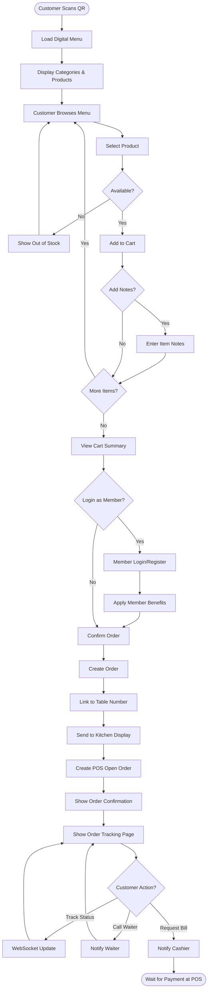
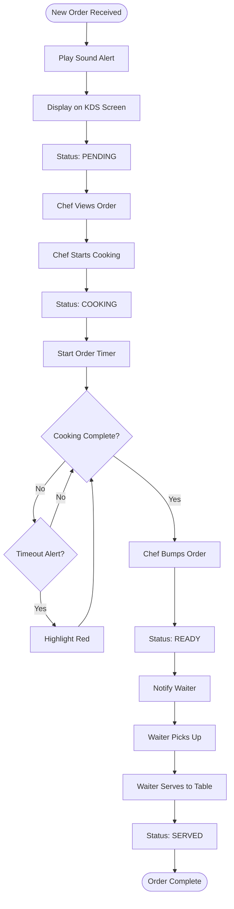
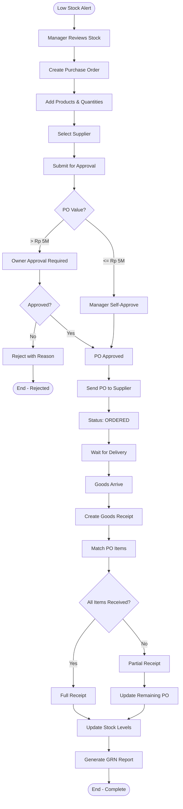
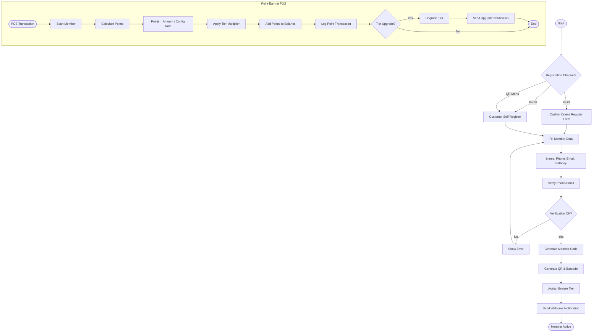
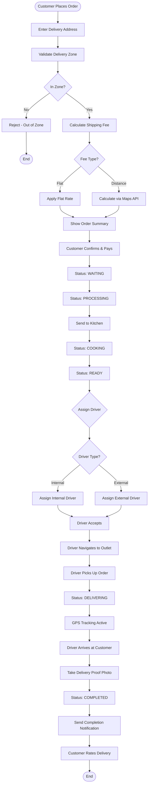
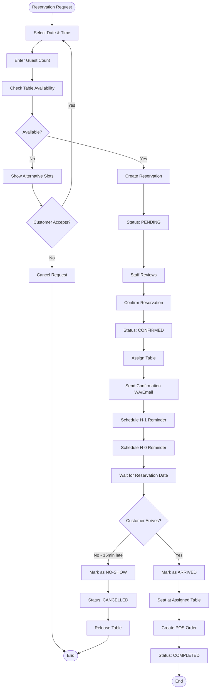
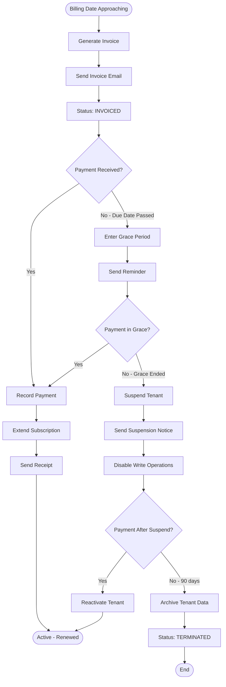
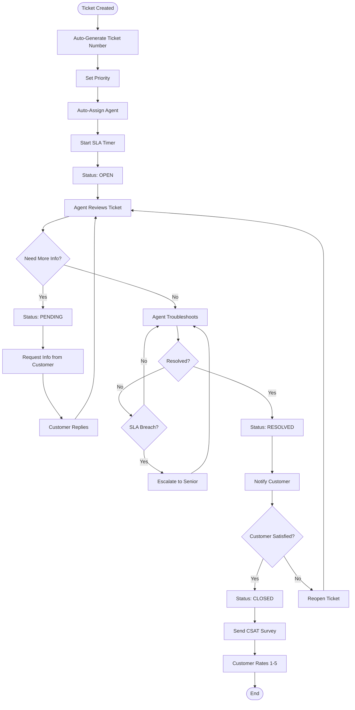
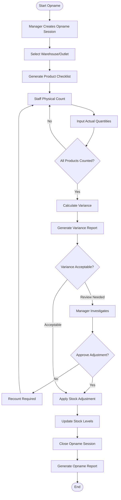

# TAHAP 1 — Activity Diagram

## CreativePOS Activity Diagrams

---

## AD-01: POS Sale Transaction

---

## AD-02: QR Digital Menu Order

---

## AD-03: Kitchen Display Order Processing

---

## AD-04: Purchase Order to Goods Receipt

---

## AD-05: Member Registration & Point Earn

---

## AD-06: Delivery Order Lifecycle

---

## AD-07: Reservation Flow

---

## AD-08: Subscription Billing Cycle

---

## AD-09: CRM Ticket Resolution

---

## AD-10: Stock Opname Process

