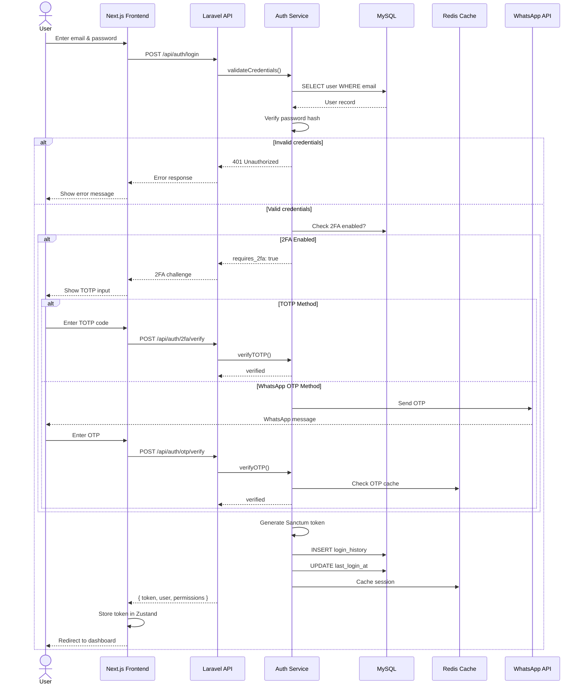
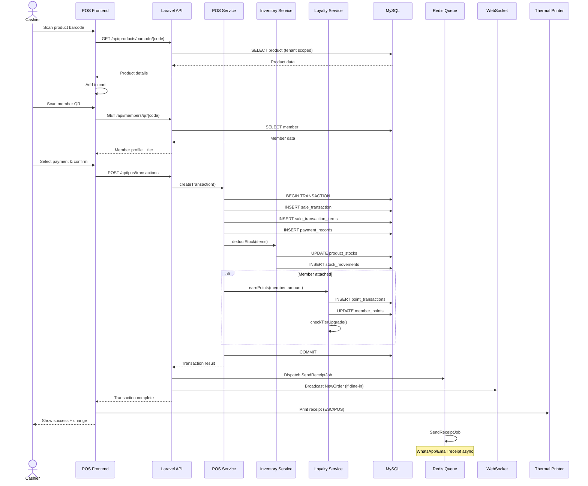
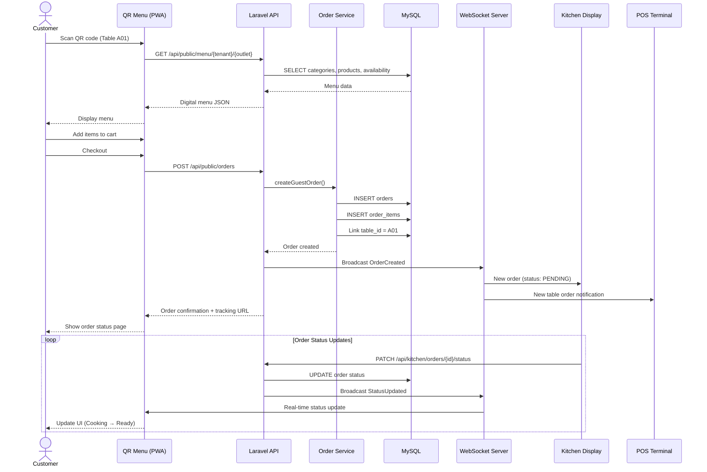
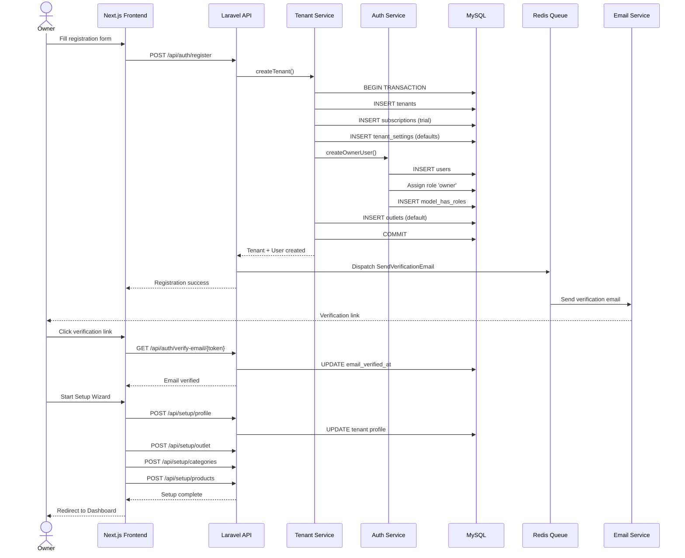
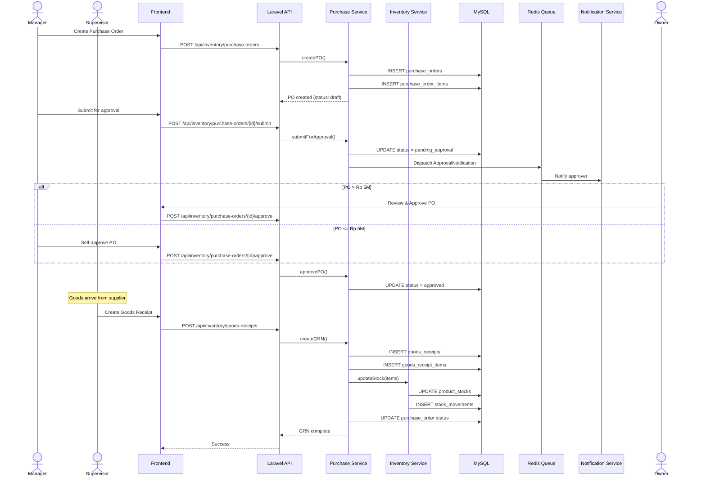
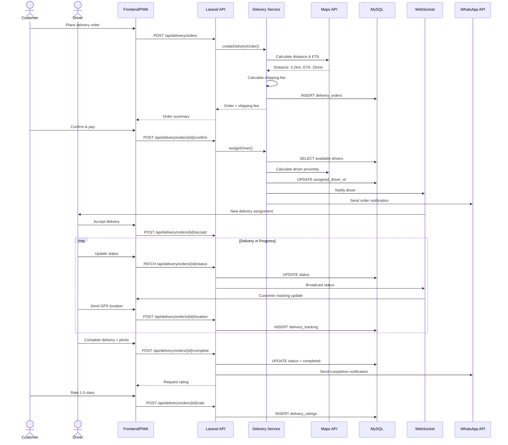
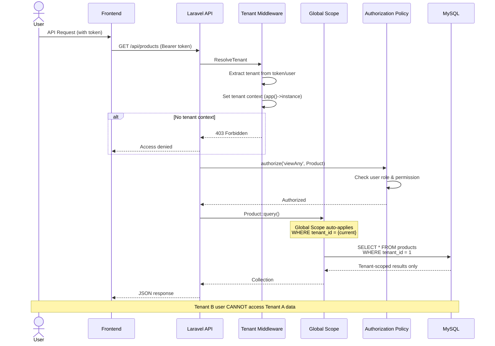
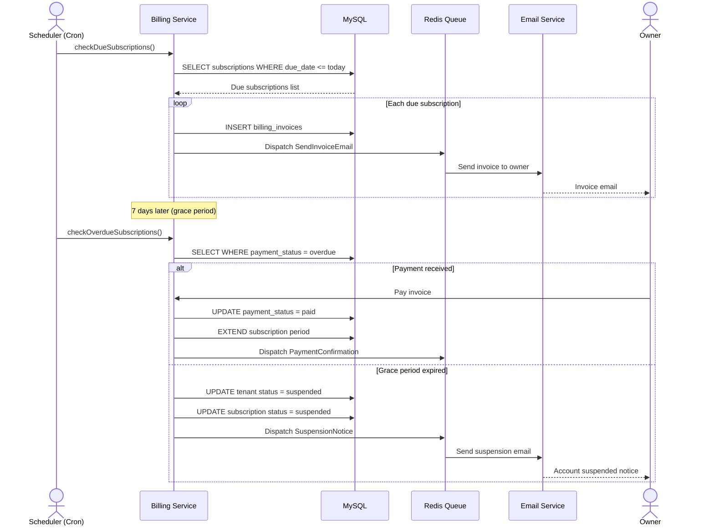
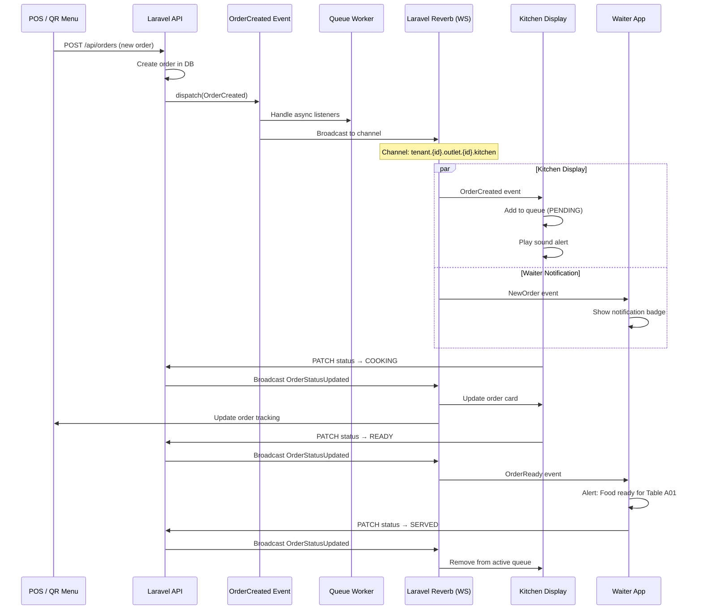
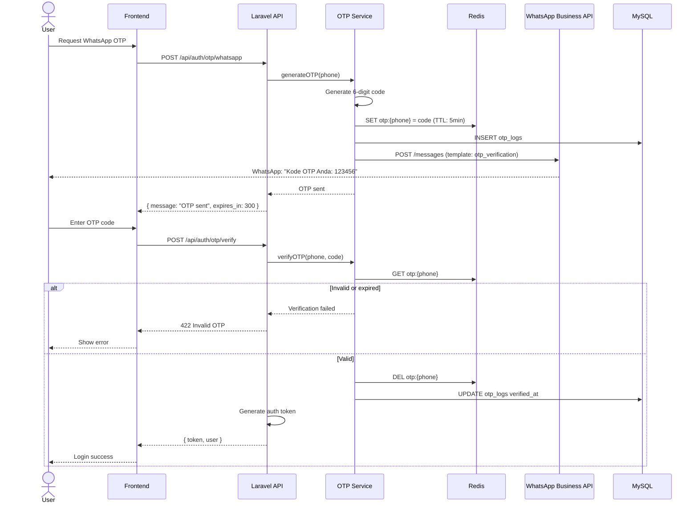

# TAHAP 1 — Sequence Diagram

## CreativePOS Sequence Diagrams

---

## SD-01: User Login with 2FA

---

## SD-02: POS Sale Transaction

---

## SD-03: QR Digital Menu Order

---

## SD-04: Tenant Registration & Onboarding

---

## SD-05: Purchase Order Approval & Goods Receipt

---

## SD-06: Delivery Order with Driver Assignment

---

## SD-07: Multi-Tenant Data Isolation

---

## SD-08: Subscription Billing

---

## SD-09: Real-time Kitchen Display (WebSocket)

---

## SD-10: WhatsApp OTP Authentication

