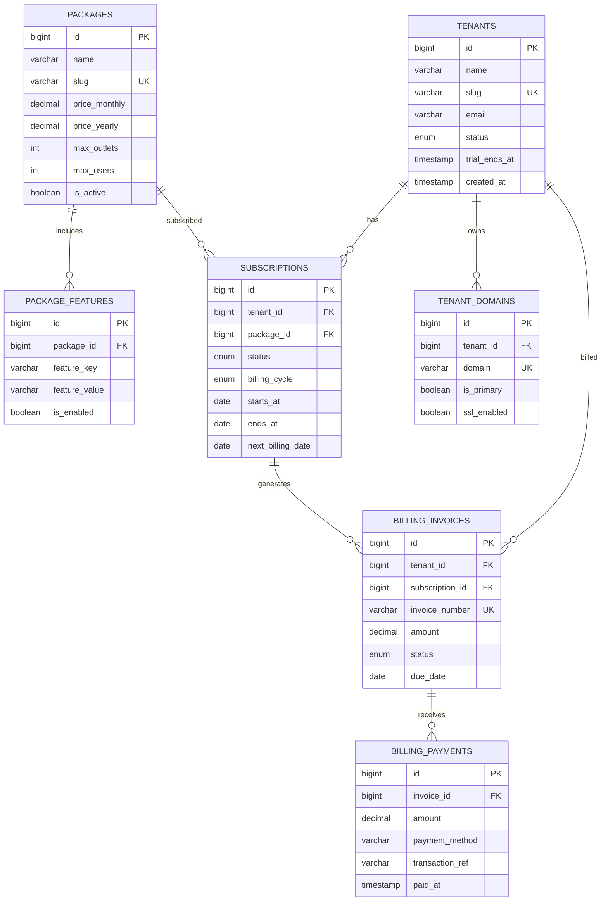
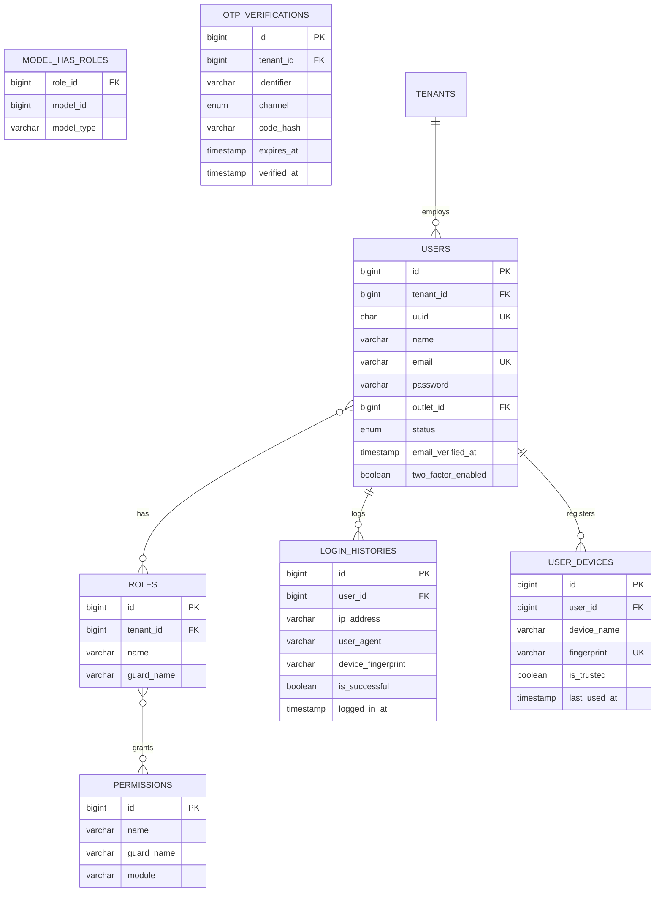
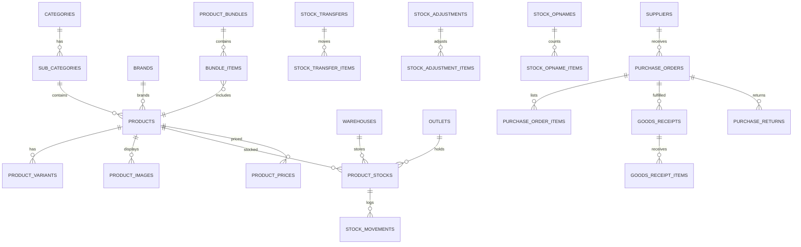
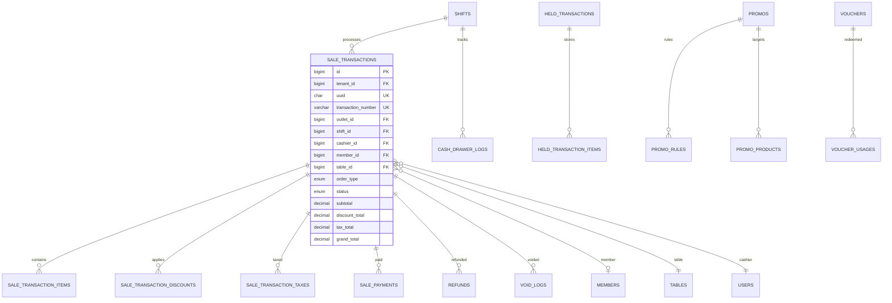
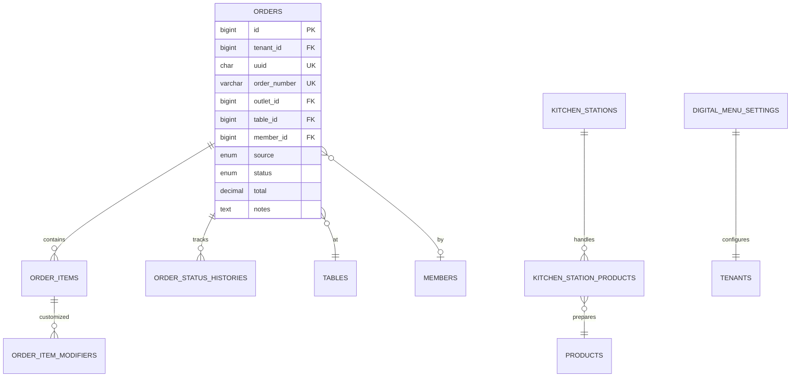
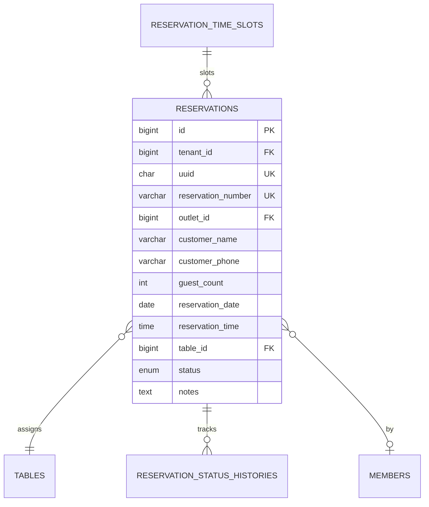
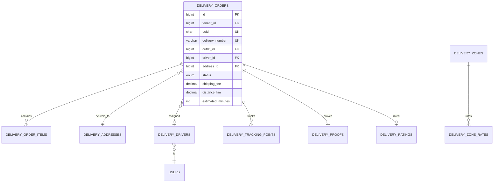
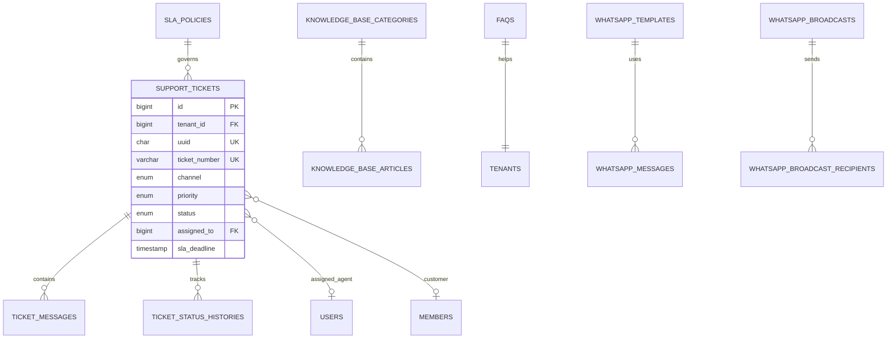
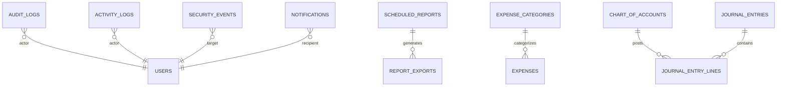

# TAHAP 2 — ERD Overview

## CreativePOS Entity Relationship Diagram

**Total Entities:** 156 tabel  
**Strategy:** Shared Database, Shared Schema, `tenant_id` discriminator

---

## 1. Master ERD — High Level

```mermaid
erDiagram
    TENANTS ||--o{ SUBSCRIPTIONS : has
    TENANTS ||--o{ USERS : has
    TENANTS ||--o{ OUTLETS : has
    TENANTS ||--o{ PRODUCTS : has
    TENANTS ||--o{ MEMBERS : has
    TENANTS ||--o{ SALE_TRANSACTIONS : has
    
    PACKAGES ||--o{ SUBSCRIPTIONS : defines
    PACKAGES ||--o{ PACKAGE_FEATURES : includes
    
    USERS ||--o{ SALE_TRANSACTIONS : creates
    USERS }o--o{ ROLES : assigned
    
    OUTLETS ||--o{ SALE_TRANSACTIONS : processes
    OUTLETS ||--o{ PRODUCT_STOCKS : holds
    OUTLETS ||--o{ SHIFTS : operates
    OUTLETS ||--o{ TABLES : contains
    
    PRODUCTS ||--o{ PRODUCT_VARIANTS : has
    PRODUCTS ||--o{ PRODUCT_STOCKS : tracked
    PRODUCTS ||--o{ SALE_TRANSACTION_ITEMS : sold
    
    MEMBERS ||--o{ MEMBER_POINTS : earns
    MEMBERS ||--|| WALLETS : owns
    MEMBERS ||--o{ POINT_TRANSACTIONS : logs
    
    SALE_TRANSACTIONS ||--o{ SALE_TRANSACTION_ITEMS : contains
    SALE_TRANSACTIONS ||--o{ SALE_PAYMENTS : paid_by
    SALE_TRANSACTIONS ||--o{ REFUNDS : may_have
    
    ORDERS ||--o{ ORDER_ITEMS : contains
    ORDERS }o--|| TABLES : assigned
    ORDERS ||--o{ ORDER_STATUS_HISTORIES : tracks
    
    RESERVATIONS }o--|| TABLES : books
    DELIVERY_ORDERS ||--o{ DELIVERY_TRACKING_POINTS : tracks
    
    SUPPORT_TICKETS ||--o{ TICKET_MESSAGES : contains
    PURCHASE_ORDERS ||--o{ GOODS_RECEIPTS : fulfilled
```



---

## 2. Platform & SaaS Billing ERD



### Tabel Domain: Platform (8)

| # | Tabel | Deskripsi |
|---|-------|-----------|
| 1 | `tenants` | Master data tenant/bisnis |
| 2 | `packages` | Paket langganan (Starter–Enterprise) |
| 3 | `package_features` | Fitur per paket (feature gating) |
| 4 | `subscriptions` | Langganan aktif tenant |
| 5 | `subscription_histories` | Riwayat perubahan subscription |
| 6 | `billing_invoices` | Invoice langganan SaaS |
| 7 | `billing_payments` | Pembayaran invoice |
| 8 | `platform_settings` | Konfigurasi global platform |

---

## 3. Authentication & RBAC ERD



### Tabel Domain: Auth & RBAC (17)

| # | Tabel | Deskripsi |
|---|-------|-----------|
| 9 | `users` | User accounts (staff & owner) |
| 10 | `password_reset_tokens` | Token reset password |
| 11 | `email_verification_tokens` | Token verifikasi email |
| 12 | `otp_verifications` | OTP email/WA/SMS |
| 13 | `login_histories` | Riwayat login |
| 14 | `user_devices` | Device management |
| 15 | `two_factor_settings` | Konfigurasi 2FA per user |
| 16 | `two_factor_recovery_codes` | Recovery codes 2FA |
| 17 | `personal_access_tokens` | Sanctum API tokens |
| 18 | `sessions` | Active sessions |
| 19 | `impersonation_logs` | Log impersonate tenant |
| 20 | `ip_whitelists` | IP whitelist per tenant |
| 21 | `roles` | Spatie roles |
| 22 | `permissions` | Spatie permissions |
| 23 | `model_has_roles` | User-role pivot |
| 24 | `model_has_permissions` | Direct permission pivot |
| 25 | `role_has_permissions` | Role-permission pivot |

---

## 4. Tenant, Outlet & Configuration ERD

```mermaid
erDiagram
    TENANTS ||--o{ OUTLETS : has
    TENANTS ||--|| TENANT_SETTINGS : configures
    OUTLETS ||--o{ BUSINESS_HOURS : operates
    OUTLETS ||--o{ TAX_CONFIGS : applies
    OUTLETS ||--o{ PRINTER_CONFIGS : uses
    OUTLETS ||--o{ TABLE_AREAS : contains
    
    OUTLETS {
        bigint id PK
        bigint tenant_id FK
        char uuid UK
        varchar name
        varchar code UK
        text address
        decimal latitude
        decimal longitude
        boolean is_active
    }
    
    TENANT_SETTINGS {
        bigint id PK
        bigint tenant_id FK UK
        varchar business_name
        varchar logo_url
        varchar timezone
        varchar currency
        decimal service_charge_rate
    }
    
    TABLE_AREAS ||--o{ TABLES : contains
    TABLES ||--|| TABLE_QR_CODES : generates
    
    TABLES {
        bigint id PK
        bigint tenant_id FK
        bigint outlet_id FK
        bigint area_id FK
        varchar table_number UK
        int capacity
        enum status
    }
```

### Tabel Domain: Tenant & Outlet (10)

| # | Tabel | Deskripsi |
|---|-------|-----------|
| 26 | `tenant_settings` | Profil & konfigurasi tenant |
| 27 | `tenant_domains` | Custom domain per tenant |
| 28 | `outlets` | Cabang/outlet |
| 29 | `outlet_settings` | Setting per outlet |
| 30 | `business_hours` | Jam operasional |
| 31 | `tax_configs` | Konfigurasi pajak (PPN) |
| 32 | `payment_method_configs` | Enable/disable metode bayar |
| 33 | `printer_configs` | Konfigurasi printer thermal |
| 34 | `receipt_templates` | Template struk |
| 35 | `integration_settings` | API keys (payment, WA, maps) |

---

## 5. Inventory & Procurement ERD



### Tabel Domain: Inventory (29)

| # | Tabel | Deskripsi |
|---|-------|-----------|
| 36 | `units_of_measure` | Satuan (PCS, KG, dll) |
| 37 | `categories` | Kategori produk |
| 38 | `sub_categories` | Sub kategori |
| 39 | `brands` | Brand/merek |
| 40 | `products` | Master produk |
| 41 | `product_variants` | Variant (size, warna) |
| 42 | `product_images` | Gambar produk |
| 43 | `product_bundles` | Paket/bundle produk |
| 44 | `bundle_items` | Item dalam bundle |
| 45 | `product_prices` | Harga per outlet |
| 46 | `modifier_groups` | Grup modifier (topping) |
| 47 | `modifiers` | Modifier items |
| 48 | `product_modifiers` | Relasi produk-modifier |
| 49 | `warehouses` | Gudang |
| 50 | `product_stocks` | Stok per warehouse/outlet |
| 51 | `stock_movements` | Log pergerakan stok |
| 52 | `stock_transfers` | Transfer antar lokasi |
| 53 | `stock_transfer_items` | Item transfer |
| 54 | `stock_adjustments` | Penyesuaian stok |
| 55 | `stock_adjustment_items` | Item adjustment |
| 56 | `stock_opnames` | Sesi stock opname |
| 57 | `stock_opname_items` | Item opname |
| 58 | `inventory_batches` | Batch/lot tracking |
| 59 | `suppliers` | Data supplier |
| 60 | `purchase_orders` | Purchase order |
| 61 | `purchase_order_items` | Item PO |
| 62 | `goods_receipts` | Penerimaan barang (GRN) |
| 63 | `goods_receipt_items` | Item GRN |
| 64 | `purchase_returns` | Retur ke supplier |
| 65 | `purchase_return_items` | Item retur |

---

## 6. Point of Sale ERD



### Tabel Domain: POS (20)

| # | Tabel | Deskripsi |
|---|-------|-----------|
| 66 | `table_areas` | Area meja (indoor, VIP, outdoor) |
| 67 | `tables` | Meja (A01, VIP01, dll) |
| 68 | `table_qr_codes` | QR code per meja |
| 69 | `shifts` | Shift kasir |
| 70 | `cash_drawer_logs` | Log cash drawer |
| 71 | `sale_transactions` | Transaksi penjualan |
| 72 | `sale_transaction_items` | Item transaksi |
| 73 | `sale_transaction_discounts` | Diskon per transaksi |
| 74 | `sale_transaction_taxes` | Pajak per transaksi |
| 75 | `sale_payments` | Pembayaran |
| 76 | `held_transactions` | Transaksi ditahan |
| 77 | `held_transaction_items` | Item held |
| 78 | `refunds` | Refund |
| 79 | `refund_items` | Item refund |
| 80 | `void_logs` | Log void |
| 81 | `promos` | Promosi |
| 82 | `promo_rules` | Aturan promo |
| 83 | `promo_products` | Produk target promo |
| 84 | `vouchers` | Voucher diskon |
| 85 | `voucher_usages` | Penggunaan voucher |
| 86 | `discount_types` | Tipe diskon master |

---

## 7. Loyalty, Member & Wallet ERD

```mermaid
erDiagram
    MEMBERS ||--|| MEMBER_POINTS : balance
    MEMBERS ||--|| WALLETS : wallet
    MEMBERS }o--|| TIER_CONFIGS : tier
    MEMBERS ||--o{ POINT_TRANSACTIONS : earns
    MEMBERS ||--o{ MEMBER_REWARDS : receives
    MEMBERS ||--o{ REFERRALS : refers
    MEMBERS ||--o{ MEMBER_ADDRESSES : lives
    
    REFERRAL_CODES ||--o{ REFERRALS : generates
    REWARDS ||--o{ MEMBER_REWARDS : grants
    
    WALLETS ||--o{ WALLET_TRANSACTIONS : logs
    WALLETS ||--o{ WALLET_TOP_UPS : topped
    WALLETS ||--o{ WALLET_WITHDRAWALS : withdrawn
    WALLET_TRANSFERS }o--|| WALLETS : from_to
    
    MEMBERS {
        bigint id PK
        bigint tenant_id FK
        char uuid UK
        varchar member_code UK
        varchar name
        varchar phone UK
        varchar email
        date birthday
        enum gender
        bigint tier_id FK
        enum status
    }
    
    WALLETS {
        bigint id PK
        bigint tenant_id FK
        bigint member_id FK UK
        decimal balance
        decimal lifetime_topup
        enum status
    }
```

### Tabel Domain: Loyalty & Wallet (17)

| # | Tabel | Deskripsi |
|---|-------|-----------|
| 87 | `members` | Data member |
| 88 | `member_addresses` | Alamat member |
| 89 | `tier_configs` | Konfigurasi tier (Bronze–Platinum) |
| 90 | `member_points` | Saldo poin member |
| 91 | `point_configs` | Konfigurasi earn rate |
| 92 | `point_transactions` | Log earn/redeem poin |
| 93 | `rewards` | Master reward |
| 94 | `member_rewards` | Reward yang diterima member |
| 95 | `referral_codes` | Kode referral |
| 96 | `referrals` | Log referral |
| 97 | `wallets` | Saldo wallet |
| 98 | `wallet_transactions` | Log transaksi wallet |
| 99 | `wallet_top_ups` | Top up wallet |
| 100 | `wallet_withdrawals` | Penarikan wallet |
| 101 | `wallet_transfers` | Transfer antar member |
| 102 | `member_portal_credentials` | Kredensial portal member |
| 103 | `birthday_rewards_log` | Log reward ulang tahun |

---

## 8. Orders, KDS & Digital Menu ERD



### Tabel Domain: Orders & KDS (8)

| # | Tabel | Deskripsi |
|---|-------|-----------|
| 104 | `orders` | Order (QR menu, POS, delivery) |
| 105 | `order_items` | Item order |
| 106 | `order_item_modifiers` | Modifier per item |
| 107 | `order_status_histories` | Riwayat status order |
| 108 | `kitchen_stations` | Station dapur (grill, bar) |
| 109 | `kitchen_station_products` | Produk per station |
| 110 | `digital_menu_settings` | Setting menu digital |
| 111 | `order_notifications` | Notifikasi order |

---

## 9. Reservation ERD



### Tabel Domain: Reservation (4)

| # | Tabel | Deskripsi |
|---|-------|-----------|
| 112 | `reservations` | Data reservasi |
| 113 | `reservation_status_histories` | Riwayat status |
| 114 | `reservation_time_slots` | Slot waktu tersedia |
| 115 | `reservation_reminders` | Log reminder terkirim |

---

## 10. Delivery ERD



### Tabel Domain: Delivery (10)

| # | Tabel | Deskripsi |
|---|-------|-----------|
| 116 | `delivery_orders` | Order delivery |
| 117 | `delivery_order_items` | Item delivery |
| 118 | `delivery_addresses` | Alamat pengantaran |
| 119 | `delivery_drivers` | Data driver |
| 120 | `delivery_tracking_points` | GPS tracking points |
| 121 | `delivery_zones` | Zona pengantaran |
| 122 | `delivery_zone_rates` | Tarif per zona |
| 123 | `delivery_ratings` | Rating pengantaran |
| 124 | `delivery_proofs` | Bukti foto pengantaran |
| 125 | `member_addresses` | *(shared with member)* |

---

## 11. CRM & WhatsApp ERD



### Tabel Domain: CRM & WhatsApp (15)

| # | Tabel | Deskripsi |
|---|-------|-----------|
| 126 | `support_tickets` | Tiket CS |
| 127 | `ticket_messages` | Pesan tiket |
| 128 | `ticket_assignments` | Assignment history |
| 129 | `ticket_status_histories` | Riwayat status |
| 130 | `sla_policies` | Kebijakan SLA |
| 131 | `knowledge_base_categories` | Kategori KB |
| 132 | `knowledge_base_articles` | Artikel KB |
| 133 | `faqs` | FAQ |
| 134 | `canned_responses` | Template balasan |
| 135 | `csat_surveys` | Survey kepuasan |
| 136 | `whatsapp_configs` | Konfigurasi WA API |
| 137 | `whatsapp_templates` | Template pesan WA |
| 138 | `whatsapp_messages` | Log pesan WA |
| 139 | `whatsapp_broadcasts` | Broadcast promo |
| 140 | `whatsapp_broadcast_recipients` | Penerima broadcast |

---

## 12. System, Audit, Reporting & Finance ERD



### Tabel Domain: System (16)

| # | Tabel | Deskripsi |
|---|-------|-----------|
| 141 | `notifications` | In-app notifications |
| 142 | `notification_templates` | Template notifikasi |
| 143 | `user_notification_preferences` | Preferensi notif user |
| 144 | `audit_logs` | Audit trail CRUD |
| 145 | `activity_logs` | User activity log |
| 146 | `security_events` | Security events |
| 147 | `scheduled_reports` | Laporan terjadwal |
| 148 | `report_exports` | File export laporan |
| 149 | `report_snapshots` | Snapshot data laporan |
| 150 | `financial_periods` | Periode keuangan |
| 151 | `expense_categories` | Kategori pengeluaran |
| 152 | `expenses` | Data pengeluaran |
| 153 | `chart_of_accounts` | Chart of accounts |
| 154 | `journal_entries` | Jurnal akuntansi |
| 155 | `journal_entry_lines` | Baris jurnal |
| 156 | `cash_flow_entries` | Arus kas |

### Reference Tables (shared)

| # | Tabel | Deskripsi |
|---|-------|-----------|
| — | `countries` | Negara |
| — | `provinces` | Provinsi |
| — | `cities` | Kota |
| — | `payment_methods` | Master metode pembayaran |
| — | `units_of_measure` | Satuan ukuran |

---

## ERD Legend

| Symbol | Meaning |
|--------|---------|
| PK | Primary Key |
| FK | Foreign Key |
| UK | Unique Key |
| AI | Auto Increment |
| `||--o{` | One to Many |
| `}o--o|` | Many to One (optional) |
| `||--||` | One to One |
| `}o--o{` | Many to Many |

---

## Tenant Isolation Rules

```
SETIAP query pada tabel tenant-scoped:
  WHERE tenant_id = {current_tenant_id}

SETIAP INSERT pada tabel tenant-scoped:
  tenant_id = {current_tenant_id}  -- auto-set via middleware

SETIAP FK dalam tenant:
  Referenced record HARUS memiliki tenant_id yang sama
  (enforced via composite FK atau application-level check)

PLATFORM tables (tanpa tenant_id):
  tenants, packages, package_features, subscriptions (has tenant_id),
  billing_*, platform_settings
```