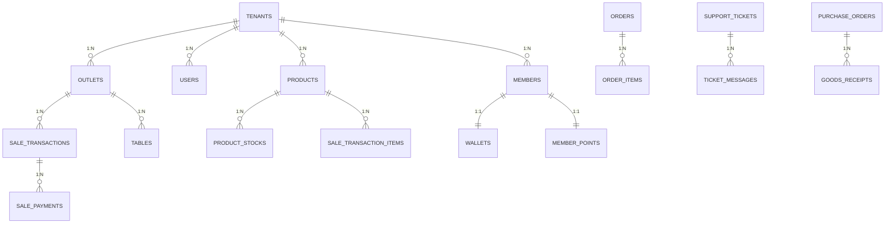

# TAHAP 2 — Table Relations & Indexes

## CreativePOS Foreign Key Map

---

## 1. Relasi Utama (Core Relationships)

### Platform Layer

```
tenants (1) ──→ (N) subscriptions
tenants (1) ──→ (N) users
tenants (1) ──→ (N) outlets
tenants (1) ──→ (1) tenant_settings
tenants (1) ──→ (N) tenant_domains
tenants (1) ──→ (N) billing_invoices

packages (1) ──→ (N) package_features
packages (1) ──→ (N) subscriptions

subscriptions (1) ──→ (N) billing_invoices
billing_invoices (1) ──→ (N) billing_payments
```

### Tenant Operations

```
outlets (1) ──→ (N) users [outlet_id]
outlets (1) ──→ (N) shifts
outlets (1) ──→ (N) tables
outlets (1) ──→ (N) sale_transactions
outlets (1) ──→ (N) warehouses
outlets (1) ──→ (N) orders
outlets (1) ──→ (N) reservations
outlets (1) ──→ (N) delivery_orders

users (1) ──→ (N) sale_transactions [cashier_id]
users (1) ──→ (N) shifts [cashier_id]
users (1) ──→ (N) login_histories
users (1) ──→ (N) user_devices
users (N) ←──→ (N) roles [via model_has_roles]
roles (N) ←──→ (N) permissions [via role_has_permissions]
```

### Product & Inventory Chain

```
categories (1) ──→ (N) sub_categories
sub_categories (1) ──→ (N) products
brands (1) ──→ (N) products
products (1) ──→ (N) product_variants
products (1) ──→ (N) product_images
products (1) ──→ (N) product_stocks
products (1) ──→ (N) sale_transaction_items
products (1) ──→ (N) order_items

warehouses (1) ──→ (N) product_stocks
product_stocks (1) ──→ (N) stock_movements

suppliers (1) ──→ (N) purchase_orders
purchase_orders (1) ──→ (N) purchase_order_items
purchase_orders (1) ──→ (N) goods_receipts
goods_receipts (1) ──→ (N) goods_receipt_items
```

### POS Transaction Chain

```
shifts (1) ──→ (N) sale_transactions
shifts (1) ──→ (N) cash_drawer_logs

sale_transactions (1) ──→ (N) sale_transaction_items
sale_transactions (1) ──→ (N) sale_transaction_discounts
sale_transactions (1) ──→ (N) sale_transaction_taxes
sale_transactions (1) ──→ (N) sale_payments
sale_transactions (1) ──→ (N) refunds
sale_transactions (1) ──→ (1) void_logs

tables (1) ──→ (1) table_qr_codes
tables (1) ──→ (N) sale_transactions
tables (1) ──→ (N) orders
tables (1) ──→ (N) reservations
```

### Member & Loyalty Chain

```
members (1) ──→ (1) member_points
members (1) ──→ (1) wallets
members (1) ──→ (N) point_transactions
members (1) ──→ (N) member_rewards
members (1) ──→ (N) member_addresses
members (1) ──→ (N) sale_transactions
members (N) ──→ (1) tier_configs

wallets (1) ──→ (N) wallet_transactions
wallets (1) ──→ (N) wallet_top_ups
wallets (1) ──→ (N) wallet_withdrawals
```

### Order & Kitchen Chain

```
orders (1) ──→ (N) order_items
order_items (1) ──→ (N) order_item_modifiers
orders (1) ──→ (N) order_status_histories
orders (1) ──→ (1) sale_transactions [optional]

kitchen_stations (N) ←──→ (N) products [via kitchen_station_products]
```

### Delivery Chain

```
delivery_orders (1) ──→ (N) delivery_order_items
delivery_orders (1) ──→ (N) delivery_tracking_points
delivery_orders (1) ──→ (1) delivery_proofs
delivery_orders (1) ──→ (1) delivery_ratings
delivery_orders (N) ──→ (1) delivery_drivers
delivery_orders (N) ──→ (1) delivery_addresses
delivery_zones (1) ──→ (N) delivery_zone_rates
```

### CRM Chain

```
support_tickets (1) ──→ (N) ticket_messages
support_tickets (1) ──→ (N) ticket_assignments
support_tickets (1) ──→ (N) ticket_status_histories
knowledge_base_categories (1) ──→ (N) knowledge_base_articles
```

---

## 2. Foreign Key Registry

| Child Table | Column | Parent Table | Parent Column | ON DELETE |
|-------------|--------|--------------|---------------|-----------|
| subscriptions | tenant_id | tenants | id | CASCADE |
| subscriptions | package_id | packages | id | RESTRICT |
| billing_invoices | tenant_id | tenants | id | RESTRICT |
| billing_invoices | subscription_id | subscriptions | id | RESTRICT |
| billing_payments | invoice_id | billing_invoices | id | RESTRICT |
| users | tenant_id | tenants | id | CASCADE |
| users | outlet_id | outlets | id | SET NULL |
| outlets | tenant_id | tenants | id | CASCADE |
| categories | tenant_id | tenants | id | CASCADE |
| sub_categories | category_id | categories | id | CASCADE |
| products | tenant_id | tenants | id | CASCADE |
| product_variants | product_id | products | id | CASCADE |
| product_stocks | product_id | products | id | RESTRICT |
| product_stocks | warehouse_id | warehouses | id | RESTRICT |
| sale_transactions | outlet_id | outlets | id | RESTRICT |
| sale_transactions | shift_id | shifts | id | SET NULL |
| sale_transactions | cashier_id | users | id | RESTRICT |
| sale_transactions | member_id | members | id | SET NULL |
| sale_transaction_items | transaction_id | sale_transactions | id | CASCADE |
| sale_payments | transaction_id | sale_transactions | id | CASCADE |
| members | tenant_id | tenants | id | CASCADE |
| member_points | member_id | members | id | CASCADE |
| wallets | member_id | members | id | CASCADE |
| orders | outlet_id | outlets | id | RESTRICT |
| order_items | order_id | orders | id | CASCADE |
| reservations | outlet_id | outlets | id | RESTRICT |
| delivery_orders | outlet_id | outlets | id | RESTRICT |
| delivery_orders | driver_id | delivery_drivers | id | SET NULL |
| support_tickets | tenant_id | tenants | id | CASCADE |
| ticket_messages | ticket_id | support_tickets | id | CASCADE |
| purchase_orders | supplier_id | suppliers | id | RESTRICT |
| goods_receipts | purchase_order_id | purchase_orders | id | RESTRICT |
| stock_transfers | from_warehouse_id | warehouses | id | RESTRICT |
| stock_transfers | to_warehouse_id | warehouses | id | RESTRICT |

---

## 3. Index Strategy

### 3.1 Mandatory Indexes (Every Tenant Table)

```sql
-- Setiap tabel dengan tenant_id WAJIB memiliki:
KEY idx_{table}_tenant (tenant_id)

-- Setiap tabel dengan uuid WAJIB memiliki:
UNIQUE KEY uk_{table}_uuid (uuid)
```

### 3.2 Composite Indexes (High-Traffic Queries)

| Table | Index | Query Pattern |
|-------|-------|---------------|
| `sale_transactions` | `(tenant_id, outlet_id, created_at)` | Dashboard revenue per outlet |
| `sale_transactions` | `(tenant_id, status, created_at)` | Transaction list filter |
| `sale_transactions` | `(tenant_id, cashier_id, created_at)` | Shift report |
| `products` | `(tenant_id, is_active, show_in_pos)` | POS product search |
| `products` | `(tenant_id, barcode)` | Barcode scan |
| `product_stocks` | `(tenant_id, warehouse_id, product_id)` | Stock lookup |
| `stock_movements` | `(tenant_id, product_id, created_at)` | Stock history |
| `members` | `(tenant_id, phone)` | Member search |
| `members` | `(tenant_id, member_code)` | Member scan |
| `orders` | `(tenant_id, outlet_id, status)` | KDS queue |
| `orders` | `(tenant_id, table_id, status)` | Table orders |
| `reservations` | `(tenant_id, reservation_date, status)` | Calendar view |
| `delivery_orders` | `(tenant_id, driver_id, status)` | Driver assignments |
| `support_tickets` | `(tenant_id, status, priority)` | Ticket queue |
| `audit_logs` | `(tenant_id, auditable_type, auditable_id)` | Audit trail |
| `point_transactions` | `(tenant_id, member_id, created_at)` | Point history |
| `wallet_transactions` | `(tenant_id, wallet_id, created_at)` | Wallet history |
| `report_snapshots` | `(tenant_id, snapshot_date, report_type)` | Report cache |

### 3.3 Full-Text Indexes

```sql
-- Product search
ALTER TABLE products ADD FULLTEXT INDEX ft_products_search (name, description, sku);

-- Knowledge base search
ALTER TABLE knowledge_base_articles ADD FULLTEXT INDEX ft_kb_search (title, content);

-- FAQ search
ALTER TABLE faqs ADD FULLTEXT INDEX ft_faqs_search (question, answer);
```

### 3.4 Covering Indexes (Report Queries)

```sql
-- Daily sales summary (covering index)
CREATE INDEX idx_sale_daily_report ON sale_transactions
    (tenant_id, outlet_id, created_at, status, grand_total);

-- Product sales ranking
CREATE INDEX idx_sale_item_report ON sale_transaction_items
    (tenant_id, product_id, transaction_id);

-- Member activity
CREATE INDEX idx_member_activity ON sale_transactions
    (tenant_id, member_id, created_at, grand_total);
```

---

## 4. Polymorphic Relations

| Table | type_column | id_column | References |
|-------|-------------|-----------|------------|
| `stock_movements` | reference_type | reference_id | sale_transactions, purchase_orders, stock_transfers, stock_adjustments, stock_opnames |
| `point_transactions` | reference_type | reference_id | sale_transactions, rewards, referrals |
| `wallet_transactions` | reference_type | reference_id | sale_transactions, wallet_top_ups, wallet_withdrawals, wallet_transfers |
| `audit_logs` | auditable_type | auditable_id | Any model |
| `notifications` | — | — | type field (string) |
| `model_has_roles` | model_type | model_id | users |
| `model_has_permissions` | model_type | model_id | users |
| `personal_access_tokens` | tokenable_type | tokenable_id | users |

---

## 5. Tenant Isolation Enforcement

### 5.1 Laravel Global Scope

```php
// App\Models\Traits\BelongsToTenant
trait BelongsToTenant
{
    protected static function bootBelongsToTenant(): void
    {
        static::addGlobalScope('tenant', function (Builder $builder) {
            if ($tenantId = tenant('id')) {
                $builder->where($builder->getModel()->getTable() . '.tenant_id', $tenantId);
            }
        });

        static::creating(function (Model $model) {
            if (!$model->tenant_id && $tenantId = tenant('id')) {
                $model->tenant_id = $tenantId;
            }
        });
    }
}
```

### 5.2 Composite Unique Constraints

Mencegah duplikasi data dalam scope tenant:

| Table | Unique Constraint |
|-------|-------------------|
| products | `(sku, tenant_id)` |
| products | `(uuid)` global |
| members | `(member_code, tenant_id)` |
| members | `(phone, tenant_id)` |
| sale_transactions | `(transaction_number, tenant_id)` |
| outlets | `(code, tenant_id)` |
| vouchers | `(code, tenant_id)` |
| suppliers | `(code, tenant_id)` |
| purchase_orders | `(po_number, tenant_id)` |
| reservations | `(reservation_number, tenant_id)` |
| delivery_orders | `(delivery_number, tenant_id)` |
| support_tickets | `(ticket_number, tenant_id)` |
| users | `(email, tenant_id)` |

### 5.3 Cross-Tenant Prevention Rules

```
RULE 1: FK dalam tenant scope harus merujuk record dengan tenant_id sama
RULE 2: API middleware set tenant context sebelum query
RULE 3: Super Admin bypass scope hanya via explicit ->withoutGlobalScope()
RULE 4: Queue jobs inherit tenant context via job payload
RULE 5: WebSocket channels scoped: tenant.{id}.outlet.{id}.{module}
```

---

## 6. Data Partitioning Strategy (Future)

Untuk skala enterprise (>10.000 tenants):

| Strategy | Table | Method |
|----------|-------|--------|
| Range partitioning | `sale_transactions` | BY RANGE (YEAR(created_at)) |
| Range partitioning | `audit_logs` | BY RANGE (YEAR(created_at)) |
| Range partitioning | `stock_movements` | BY RANGE (YEAR(created_at)) |
| Archive tables | `sale_transactions_archive` | Move data > 2 years |
| Read replicas | All read-heavy tables | MySQL replication |

---

## 7. Cascade Delete Map

```
DELETE tenant → CASCADE:
  ├── users, outlets, products, members, categories
  ├── sale_transactions, orders, reservations
  ├── support_tickets, wallets, warehouses
  └── ALL tenant-scoped tables

DELETE sale_transaction → CASCADE:
  ├── sale_transaction_items
  ├── sale_transaction_discounts
  ├── sale_transaction_taxes
  └── sale_payments

DELETE order → CASCADE:
  ├── order_items → order_item_modifiers
  └── order_status_histories

DELETE member → CASCADE:
  ├── member_points, wallets, member_addresses
  └── point_transactions

DELETE purchase_order → RESTRICT (if has GRN):
  Must cancel/complete PO first

DELETE product → RESTRICT (if has stock/sales):
  Soft delete only (deleted_at)
```

---

## 8. Relationship Cardinality Summary

