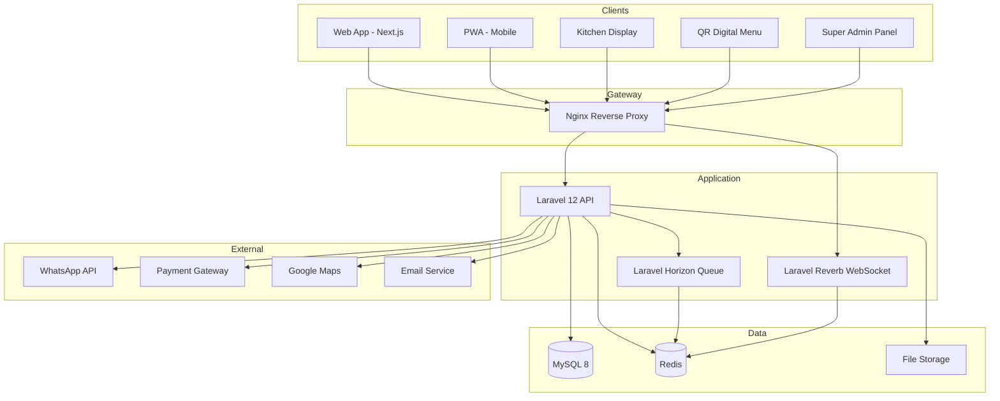
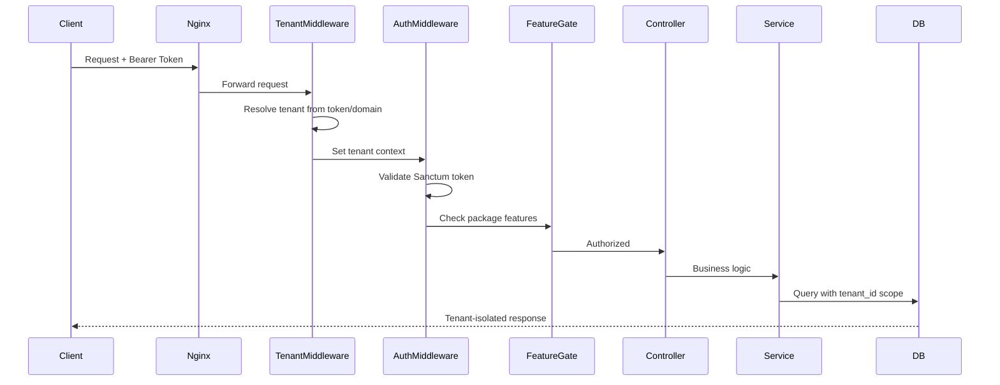

# TAHAP 3 — Architecture Overview

## CreativePOS System Architecture

---

## 1. High-Level Architecture



---

## 2. Clean Architecture Layers

```
┌─────────────────────────────────────────────────────────────┐
│                    PRESENTATION LAYER                        │
│  Controllers │ API Resources │ Form Requests │ Middleware    │
│  Policies │ Routes │ WebSocket Handlers                      │
└────────────────────────────┬────────────────────────────────┘
                             │
┌────────────────────────────▼────────────────────────────────┐
│                    APPLICATION LAYER                         │
│  Services │ DTOs │ Events │ Listeners │ Jobs │ Notifications │
│  Actions │ Query Filters │ Feature Gates                     │
└────────────────────────────┬────────────────────────────────┘
                             │
┌────────────────────────────▼────────────────────────────────┐
│                      DOMAIN LAYER                            │
│  Models │ Enums │ Value Objects │ Contracts/Interfaces       │
│  Domain Events │ Business Rules                              │
└────────────────────────────┬────────────────────────────────┘
                             │
┌────────────────────────────▼────────────────────────────────┐
│                   INFRASTRUCTURE LAYER                       │
│  Repositories │ External APIs │ File Storage │ Cache         │
│  Queue │ Mail │ SMS/WhatsApp │ Payment Gateway               │
└─────────────────────────────────────────────────────────────┘
```

### Dependency Rule

```
Presentation → Application → Domain ← Infrastructure
                                ↑
                    Infrastructure implements Domain Contracts
```

---

## 3. Modular Architecture

Backend diorganisir sebagai **Laravel Modules** menggunakan namespace `App\Modules\{ModuleName}`:

| Module | Namespace | Responsibility |
|--------|-----------|----------------|
| Platform | `App\Modules\Platform` | Super Admin, SaaS billing |
| Auth | `App\Modules\Auth` | Login, 2FA, OTP, sessions |
| Tenant | `App\Modules\Tenant` | Tenant & outlet management |
| Inventory | `App\Modules\Inventory` | Products, stock, procurement |
| POS | `App\Modules\POS` | Transactions, shifts, payments |
| Loyalty | `App\Modules\Loyalty` | Members, points, tiers, rewards |
| Wallet | `App\Modules\Wallet` | Member wallet operations |
| Order | `App\Modules\Order` | Orders, KDS, digital menu |
| Reservation | `App\Modules\Reservation` | Table reservations |
| Delivery | `App\Modules\Delivery` | Delivery orders, drivers, GPS |
| CRM | `App\Modules\CRM` | Tickets, knowledge base, CSAT |
| WhatsApp | `App\Modules\WhatsApp` | WA integration, broadcasts |
| Report | `App\Modules\Report` | Reports, exports, snapshots |
| Dashboard | `App\Modules\Dashboard` | KPI, charts, real-time feed |
| Notification | `App\Modules\Notification` | In-app, email, push |
| Audit | `App\Modules\Audit` | Audit log, activity, security |

### Shared Kernel

```
App\
├── Shared\
│   ├── Contracts\          # Repository interfaces
│   ├── Traits\             # BelongsToTenant, HasUuid, Auditable
│   ├── Enums\              # Shared enums
│   ├── Exceptions\         # Custom exceptions
│   ├── Middleware\         # TenantResolver, CheckSubscription
│   ├── Scopes\             # TenantScope
│   └── Helpers\            # Utility functions
├── Providers\
└── Http\
    └── Kernel.php
```

---

## 4. Multi-Tenant Request Flow



### Tenant Resolution Strategy

| Priority | Method | Example |
|----------|--------|---------|
| 1 | Bearer token (user.tenant_id) | API requests |
| 2 | Subdomain | `warung-makan.creativepos.app` |
| 3 | Custom domain | `pos.warungmakan.com` |
| 4 | Path prefix | `creativepos.app/t/warung-makan` |
| 5 | Header | `X-Tenant-ID` (internal/dev) |

---

## 5. Event-Driven Architecture

### Domain Events

| Event | Listeners | Queue |
|-------|-----------|-------|
| `SaleTransactionCompleted` | DeductStock, EarnPoints, SendReceipt, UpdateDashboard | Yes |
| `OrderCreated` | BroadcastToKitchen, NotifyWaiter | Yes (real-time via WS) |
| `OrderStatusUpdated` | BroadcastStatus, UpdateKDS | Real-time |
| `MemberRegistered` | CreateWallet, CreatePoints, SendWelcome | Yes |
| `ReservationConfirmed` | ScheduleReminders | Yes |
| `DeliveryAssigned` | NotifyDriver, StartTracking | Yes |
| `TicketCreated` | AutoAssign, StartSLA | Yes |
| `SubscriptionExpiring` | SendInvoice, NotifyOwner | Yes (scheduled) |
| `StockBelowMinimum` | SendStockAlert | Yes |

### Event Flow Pattern

```
Controller → Service → Model → Event::dispatch()
                                    │
                    ┌───────────────┼───────────────┐
                    │               │               │
               Listener 1     Listener 2     Listener 3
               (sync/async)   (async/queue)  (broadcast/WS)
```

---

## 6. Security Architecture

```
┌─────────────────────────────────────────────────────────┐
│                    SECURITY LAYERS                         │
│                                                          │
│  Layer 1: Network                                          │
│    ├── HTTPS/TLS 1.3 (Nginx)                            │
│    ├── Rate limiting (Nginx + Laravel)                  │
│    └── IP whitelist (optional, Enterprise)              │
│                                                          │
│  Layer 2: Authentication                                   │
│    ├── Sanctum SPA + API tokens                         │
│    ├── 2FA (TOTP / WhatsApp OTP)                        │
│    ├── Session management + device tracking             │
│    └── Brute force protection (rate limit + lockout)    │
│                                                          │
│  Layer 3: Authorization                                    │
│    ├── Spatie Permission (RBAC)                         │
│    ├── Laravel Policies (resource-level)                │
│    ├── Feature gating (subscription package)            │
│    └── Tenant isolation (global scope)                  │
│                                                          │
│  Layer 4: Data Protection                                  │
│    ├── Input validation (Form Requests)                 │
│    ├── XSS protection (CSP headers)                     │
│    ├── SQL injection (Eloquent ORM)                     │
│    ├── CSRF (Sanctum SPA)                               │
│    └── Encryption (sensitive fields at rest)          │
│                                                          │
│  Layer 5: Audit & Monitoring                               │
│    ├── Audit log (all CRUD)                             │
│    ├── Activity log (user actions)                      │
│    ├── Login history                                    │
│    └── Security events                                  │
└─────────────────────────────────────────────────────────┘
```

---

## 7. Real-Time Architecture (WebSocket)

### Channel Structure

```
tenant.{tenantId}.outlet.{outletId}.kitchen     → KDS orders
tenant.{tenantId}.outlet.{outletId}.pos         → POS notifications
tenant.{tenantId}.outlet.{outletId}.dashboard   → Live KPI feed
tenant.{tenantId}.delivery.{orderId}            → Delivery tracking
tenant.{tenantId}.table.{tableId}              → QR menu order status
user.{userId}                                   → Personal notifications
```

### Broadcasting Events

| Broadcast Event | Channel | Payload |
|---------------|---------|---------|
| `OrderCreated` | kitchen | order details, items |
| `OrderStatusUpdated` | kitchen, table, pos | status, elapsed time |
| `NewTransaction` | dashboard | amount, outlet |
| `StockAlert` | dashboard | product, quantity |
| `DeliveryLocationUpdated` | delivery.{id} | lat, lng, ETA |
| `TicketAssigned` | user.{agentId} | ticket details |

---

## 8. Caching Strategy

| Data | Cache Key Pattern | TTL | Invalidation |
|------|-------------------|-----|--------------|
| Tenant settings | `tenant:{id}:settings` | 1 hour | On update |
| Product catalog | `tenant:{id}:products:{outletId}` | 15 min | On product change |
| Dashboard KPI | `tenant:{id}:dashboard:{outletId}:{date}` | 5 min | On transaction |
| Permissions | `user:{id}:permissions` | 30 min | On role change |
| Package features | `package:{id}:features` | 24 hours | On package update |
| Menu (QR) | `tenant:{id}:menu:{outletId}` | 10 min | On product/availability change |

---

## 9. Queue Architecture

### Queue Names (Horizon)

| Queue | Priority | Jobs |
|-------|----------|------|
| `critical` | Highest | Payment processing, OTP |
| `high` | High | Receipt send, stock deduct |
| `default` | Normal | Notifications, reports |
| `low` | Low | Broadcasts, snapshots |
| `webhook` | Normal | WA webhook, payment callback |

### Horizon Configuration

```php
'environments' => [
    'production' => [
        'supervisor-critical' => ['queue' => ['critical'], 'maxProcesses' => 5],
        'supervisor-high'     => ['queue' => ['high'], 'maxProcesses' => 10],
        'supervisor-default'  => ['queue' => ['default'], 'maxProcesses' => 10],
        'supervisor-low'      => ['queue' => ['low'], 'maxProcesses' => 3],
    ],
],
```

---

## 10. API Versioning

```
/api/v1/...     → Current stable API
/api/v2/...     → Future breaking changes

Header: Accept: application/json
Header: X-Api-Version: 1 (optional)
```

---

## 11. Frontend Architecture Pattern

```
┌─────────────────────────────────────────────────────────┐
│  Next.js 15 App Router                                   │
│                                                          │
│  app/                                                    │
│    (auth)/          → Login, Register (public)          │
│    (dashboard)/     → Protected routes (RBAC guard)     │
│    (pos)/           → POS fullscreen layout              │
│    (kitchen)/       → KDS fullscreen layout             │
│    (menu)/          → Public QR menu (no auth)          │
│    (platform)/      → Super Admin panel                 │
│                                                          │
│  State: Zustand (global) + React Query (server state)   │
│  UI: ShadCN UI + TailwindCSS                            │
│  Auth: Sanctum cookie (SPA) + token (API/mobile)        │
└─────────────────────────────────────────────────────────┘
```