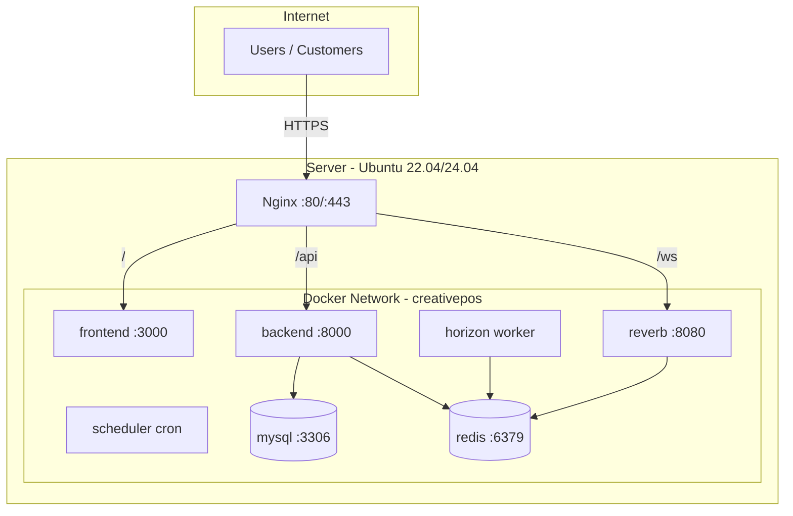
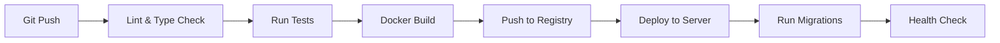

# TAHAP 3 — Deployment Architecture

## Infrastructure Overview



---

## Docker Services

| Service | Image | Port | Purpose |
|---------|-------|------|---------|
| `nginx` | nginx:alpine | 80, 443 | Reverse proxy, SSL |
| `frontend` | custom (Node 22) | 3000 | Next.js app |
| `backend` | custom (PHP 8.4) | 8000 | Laravel API |
| `reverb` | custom (PHP 8.4) | 8080 | WebSocket server |
| `horizon` | custom (PHP 8.4) | — | Queue worker |
| `scheduler` | custom (PHP 8.4) | — | Cron scheduler |
| `mysql` | mysql:8.0 | 3306 | Database |
| `redis` | redis:7-alpine | 6379 | Cache + Queue |

---

## Server Requirements

### Minimum (Starter / Dev)

| Resource | Spec |
|----------|------|
| CPU | 2 vCPU |
| RAM | 4 GB |
| Storage | 40 GB SSD |
| OS | Ubuntu 22.04 LTS |

### Recommended (Production)

| Resource | Spec |
|----------|------|
| CPU | 4 vCPU |
| RAM | 8 GB |
| Storage | 80 GB SSD |
| OS | Ubuntu 24.04 LTS |
| Backup | Daily automated |

### Enterprise (High Traffic)

| Resource | Spec |
|----------|------|
| CPU | 8+ vCPU |
| RAM | 16+ GB |
| Storage | 160 GB SSD |
| DB | Separate MySQL server |
| Redis | Separate Redis server |
| Load Balancer | Optional |

---

## Network Topology

```
                    ┌──────────────┐
    Internet ──────►│   Firewall   │
                    │  (UFW/CSF)   │
                    └──────┬───────┘
                           │ :80, :443
                    ┌──────▼───────┐
                    │    Nginx     │
                    │  SSL/TLS     │
                    └──┬───┬───┬──┘
                       │   │   │
              ┌────────┘   │   └────────┐
              │            │            │
        ┌─────▼─────┐ ┌───▼────┐ ┌────▼─────┐
        │ Frontend  │ │ Backend│ │  Reverb  │
        │  :3000    │ │ :8000  │ │  :8080   │
        └───────────┘ └───┬────┘ └────┬─────┘
                          │           │
                    ┌─────▼───────────▼─────┐
                    │        Redis          │
                    │        :6379          │
                    └───────────┬───────────┘
                                │
                    ┌───────────▼───────────┐
                    │        MySQL          │
                    │        :3306          │
                    └───────────────────────┘
```

---

## Environment Variables

### Backend (.env)

```env
APP_NAME=CreativePOS
APP_ENV=production
APP_KEY=base64:...
APP_URL=https://api.creativepos.app
APP_DEBUG=false

DB_CONNECTION=mysql
DB_HOST=mysql
DB_PORT=3306
DB_DATABASE=creativepos
DB_USERNAME=creativepos
DB_PASSWORD=...

REDIS_HOST=redis
REDIS_PORT=6379

CACHE_STORE=redis
SESSION_DRIVER=redis
QUEUE_CONNECTION=redis

BROADCAST_CONNECTION=reverb
REVERB_APP_ID=creativepos
REVERB_APP_KEY=...
REVERB_APP_SECRET=...
REVERB_HOST=ws.creativepos.app
REVERB_PORT=443
REVERB_SCHEME=https

SANCTUM_STATEFUL_DOMAINS=creativepos.app,*.creativepos.app
SESSION_DOMAIN=.creativepos.app

MAIL_MAILER=smtp
MAIL_HOST=...
MAIL_FROM_ADDRESS=noreply@creativepos.app

FILESYSTEM_DISK=s3
AWS_ACCESS_KEY_ID=...
AWS_SECRET_ACCESS_KEY=...
AWS_DEFAULT_REGION=ap-southeast-1
AWS_BUCKET=creativepos-storage

HORIZON_PREFIX=creativepos_horizon:
```

### Frontend (.env)

```env
NEXT_PUBLIC_API_URL=https://api.creativepos.app/api/v1
NEXT_PUBLIC_WS_URL=wss://ws.creativepos.app
NEXT_PUBLIC_APP_URL=https://creativepos.app
NEXT_PUBLIC_APP_NAME=CreativePOS
```

---

## SSL/TLS Configuration

- **Provider:** Let's Encrypt (Certbot)
- **Protocol:** TLS 1.2+ only
- **Auto-renewal:** Certbot cron
- **Domains:**
  - `creativepos.app` (frontend)
  - `api.creativepos.app` (backend API)
  - `ws.creativepos.app` (WebSocket)
  - `*.creativepos.app` (tenant subdomains)

---

## CI/CD Pipeline



### Pipeline Stages

| Stage | Backend | Frontend |
|-------|---------|----------|
| Lint | PHP CS Fixer, PHPStan | ESLint, Prettier |
| Test | PHPUnit, Pest | Jest (optional) |
| Build | Docker image | Docker image (standalone) |
| Deploy | SSH + docker compose | SSH + docker compose |
| Post-deploy | `php artisan migrate`, `horizon:terminate` | — |

---

## Backup Strategy

| Data | Method | Frequency | Retention |
|------|--------|-----------|-----------|
| MySQL | mysqldump + gzip | Daily 02:00 | 30 days |
| Redis | RDB snapshot | Daily | 7 days |
| Files (S3) | S3 versioning | Continuous | 90 days |
| Docker volumes | Volume backup | Weekly | 4 weeks |

---

## Monitoring

| Tool | Purpose |
|------|---------|
| Laravel Horizon | Queue monitoring |
| Laravel Telescope | Debug (staging only) |
| Uptime monitoring | External ping (UptimeRobot) |
| Log aggregation | `storage/logs` + logrotate |
| Disk/Memory alerts | Server monitoring script |

---

## Scaling Path

| Stage | Action |
|-------|--------|
| 1 | Single server (all services) |
| 2 | Separate MySQL server |
| 3 | Separate Redis server |
| 4 | Multiple Horizon workers |
| 5 | Load balancer + multiple backend instances |
| 6 | CDN for static assets |
| 7 | Read replicas for MySQL |